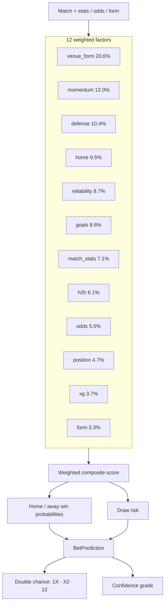

<div align="center">

[](https://github.com/slickml/slick-bet/actions/workflows/ci.yml)
[](https://codecov.io/gh/slickml/slick-bet)
[](https://pepy.tech/project/slickbet)
[](https://github.com/slickml/slick-bet/blob/master/LICENSE)


[](https://www.slickml.com/slack-invite)


</div>

<p align="center">
  <a href="https://github.com/slickml/slick-bet">
    
  </a>
</p>

<div align="center">
<h1 align="center">SlickBet ⚽: Soccer Betting Screener by SlickML🧞</h1>
  <p align="center">
    <a href="https://github.com/slickml/slick-bet/releases">Explore Releases</a>
    🟣
    <a href="https://pypi.org/project/slickbet/">PyPI</a>
    🟣
    <a href="https://www.slickml.com/slack-invite">Join our Slack</a>
    🟣
    <a href="https://twitter.com/slickml">Tweet Us</a>
  </p>
</div>

## 🧠 Philosophy

**SlickBet ⚽** screens soccer matches via the [Livescore API](https://live-score-api.com/football-api),
scores each fixture with a **12-factor** statistical model (form, venue, xG, odds, and more),
and ranks betting opportunities — including safer **double-chance** picks.

Same SlickML spirit: prototype fast 🏎, keep axes clear, and **measure** with backtests 🔎.

```text
fixtures  ×  model  ×  filters  ×  backtest  ×  export
```

## ✨ Features

- 📅 **Multi-day screening** — next N days of fixtures
- 📊 **12-factor model** — form, position, home, H2H, odds, goals, venue form, defense, momentum, match stats, xG, reliability
- 🎲 **Double chance** — 1X / X2 / 12 with confidence grades
- 🌍 **League coverage** — major & minor Europe, Asia, Americas
- 📈 **Backtesting** — historical accuracy + API response cache
- 🔧 **Hyperparameter tuning** — search weights on cached data
- 📄 **PDF / JSON export** — shareable reports and CLI scripting

## 🛠 Installation

Install Python `>=3.10,<3.14` and [uv](https://docs.astral.sh/uv/), then:

```bash
git clone https://github.com/slickml/slick-bet.git
cd slick-bet
uv sync --locked --all-extras --all-groups
```

Task runner is [Poe the Poet](https://poethepoet.natn.io/) (same idea as [slick-tune](https://github.com/slickml/slick-tune)). Install once:

```bash
uv tool install poethepoet
poe greet
```

## ⚙️ Configuration

Set [Livescore API](https://live-score-api.com/football-api) credentials:

```bash
export LIVESCORE_API_KEY="your_api_key"
export LIVESCORE_API_SECRET="your_api_secret"
```

## 📌 Quick Start

```bash
# Screen all leagues for tomorrow (top 20)
poe run-all --days=1 --top=20

# Major European leagues only
poe run-major

# Backtest all leagues for 1 week
poe backtest-all-global --weeks=1
```

```python
from slickbet import BettingScreener, ScreenerConfig

config = ScreenerConfig(min_probability=0.60, all_leagues=True)
screener = BettingScreener(config=config)
result = screener.screen_days(3)

for bet in result.get_top_k(10):
    best_dc, prob = bet.double_chance.best_double_chance
    print(f"{bet.match.home_team.name} vs {bet.match.away_team.name}: {best_dc} @ {prob:.1%}")
```

## 📋 Commands

### Screener

| Command | Description |
| --- | --- |
| `poe run-all --days N` | Screen ALL leagues for next N days |
| `poe run-all-week` | Screen ALL leagues for next 7 days |
| `poe run-major` | Major European leagues (tomorrow) |
| `poe run-major-week` | Major European leagues for 7 days |
| `poe run-pl --days N` | Premier League only |
| `poe run-bundesliga --days N` | Bundesliga only |
| `poe run-laliga --days N` | La Liga only |
| `poe run-seriea --days N` | Serie A only |
| `poe run-ligue1 --days N` | Ligue 1 only |
| `poe run` | Screen tomorrow's games |
| `poe run-top --top K` | Show top K opportunities |
| `poe run-days --days N` | Screen next N days |

### Backtest & tune

| Command | Description |
| --- | --- |
| `poe backtest-all --weeks N` | Major + minor European leagues |
| `poe backtest-all-global --weeks N` | All leagues (EU + Asia + Americas) |
| `poe backtest-pl --weeks N` | Premier League backtest |
| `poe tune --cache-dir DIR` | Tune weights on cached API data |

**API cache** (fast reruns / offline tune):

```bash
# Populate cache
slickbet backtest-all --weeks 12 --cache-dir data/api_cache

# Offline rerun
slickbet backtest-all --weeks 12 --cache-dir data/api_cache --cache-only

# Tune weights
slickbet tune --cache-dir data/api_cache --trials 20
```

### Development

| Command | Description |
| --- | --- |
| `poe check` | Format check + ruff + mypy |
| `poe test` | Pytest with 100% coverage gate |
| `poe build` | Build sdist + wheel |
| `poe fix` | Auto-fix lint + format |
| `poe clean` | Remove caches and build artifacts |

## 💻 CLI

```bash
slickbet                          # tomorrow
slickbet --days 5 --top 10
slickbet --major-only
slickbet --asia-only
slickbet --americas-only
slickbet --all-leagues
slickbet --league 2               # competition ID
slickbet --min-prob 0.60
slickbet --json
slickbet --pdf my_report.pdf

slickbet backtest --competition 2 --weeks 4
slickbet backtest-all --include-asia --include-americas --weeks 4
slickbet competitions --country England
slickbet tune --cache-dir data/api_cache
```

## 🏆 League IDs

### Major Europe
| ID | League | Country |
| --- | --- | --- |
| 1 | Bundesliga | Germany |
| 2 | Premier League | England |
| 3 | La Liga | Spain |
| 4 | Serie A | Italy |
| 5 | Ligue 1 | France |

### Minor Europe
| ID | League | Country |
| --- | --- | --- |
| 68 | Belgian Pro League | Belgium |
| 8 | Primeira Liga | Portugal |
| 6 | Super Lig | Turkey |
| 196 | Eredivisie | Netherlands |
| 17 | 1. HNL | Croatia |
| 60 | Ekstraklasa | Poland |
| 75 | Premiership | Scotland |
| 9 | Super League | Greece |

### Asia
| ID | League | Country |
| --- | --- | --- |
| 313 | Saudi Pro League | Saudi Arabia |
| 67 | Hyundai A-League | Australia |
| 28 | J. League | Japan |

### Americas
| ID | League | Country |
| --- | --- | --- |
| 23 | Liga Professional | Argentina |
| 24 | Serie A | Brazil |
| 45 | Liga MX | Mexico |

Use `slickbet competitions --country <name>` to discover more IDs.

## 🧠 Model



Tuned **12-factor** weights (`BettingModel.WEIGHTS` in `src/slickbet/model.py`):

| Factor | Weight | Description |
| --- | --- | --- |
| Venue form | 20.6% | Home/away specific win rates |
| Momentum | 12.0% | First-half lead + win rate + comebacks |
| Defense | 10.4% | Clean sheet rate |
| Home advantage | 9.5% | Historical home edge |
| Reliability | 8.7% | Discipline / cards |
| Goals | 8.6% | Attack/defense strength |
| Match stats | 7.1% | Possession, shots, conversion |
| H2H | 6.1% | Head-to-head |
| Odds | 5.5% | Bookmaker implied probability |
| Position | 4.7% | Table differential |
| xG | 3.7% | Expected goals differential |
| Form | 3.3% | Last 5 results |

### Double chance & grades

- **1X** — home or draw · **X2** — away or draw · **12** — no draw
- 🔥 HIGH VALUE · ✅ GOOD BET · 👍 DECENT · ⚠️ RISKY


### Backtest snippet (Python)

```python
from slickbet import Backtester, format_backtest_report

results = Backtester().run(competition_id="313", weeks=4)
print(format_backtest_report(results))
print(f"Excl. draws: {results.accuracy_excluding_draws:.1%}")
print(f"Best DC: {results.best_double_chance_accuracy:.1%}")
```

## 📁 Project structure

```text
slick-bet/
├── assets/
│   └── logo.png
├── src/slickbet/
│   ├── __init__.py
│   ├── api.py          # Livescore client + domain models
│   ├── model.py        # 12-factor betting model
│   ├── screener.py     # Screening + formatting
│   ├── backtest.py     # Historical evaluation
│   ├── cache.py        # File-based API cache
│   ├── tune.py         # Weight search
│   ├── cli.py          # `slickbet` entrypoint
│   └── pdf_export.py   # ReportLab PDFs
├── tests/
├── .github/workflows/  # ci.yml + cd.yml only
├── .coveragerc
├── ruff.toml
├── mypy.ini
├── pytest.ini
├── pyproject.toml
└── README.md
```

## ⚠️ Disclaimer

For **educational and entertainment purposes only**.

- Past performance does not guarantee future results
- Sports betting involves risk of financial loss
- Predict responsibly and within your means
- Check local laws in your jurisdiction

## ❓ Need help?

Join our [Slack](https://www.slickml.com/slack-invite) to talk with the SlickML team.

## License

MIT — see [LICENSE](LICENSE).
